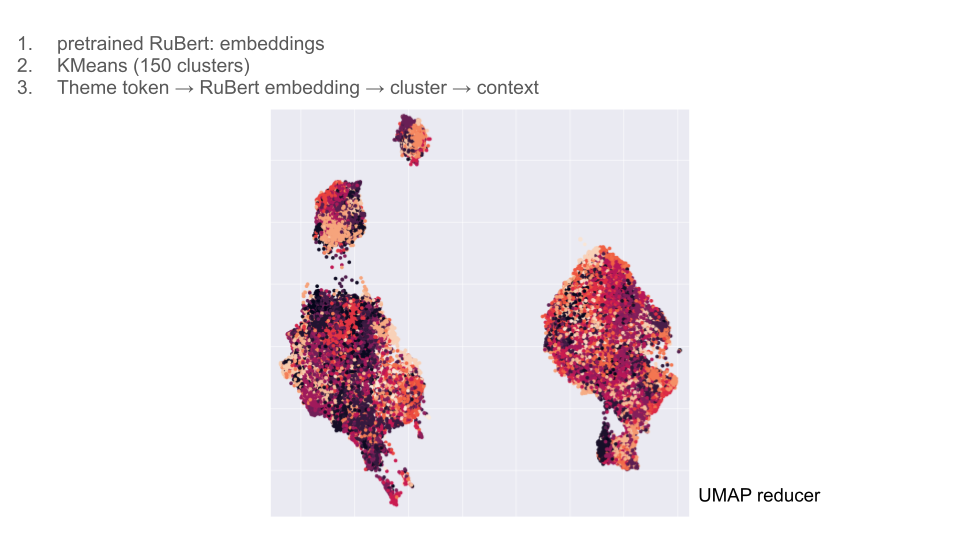
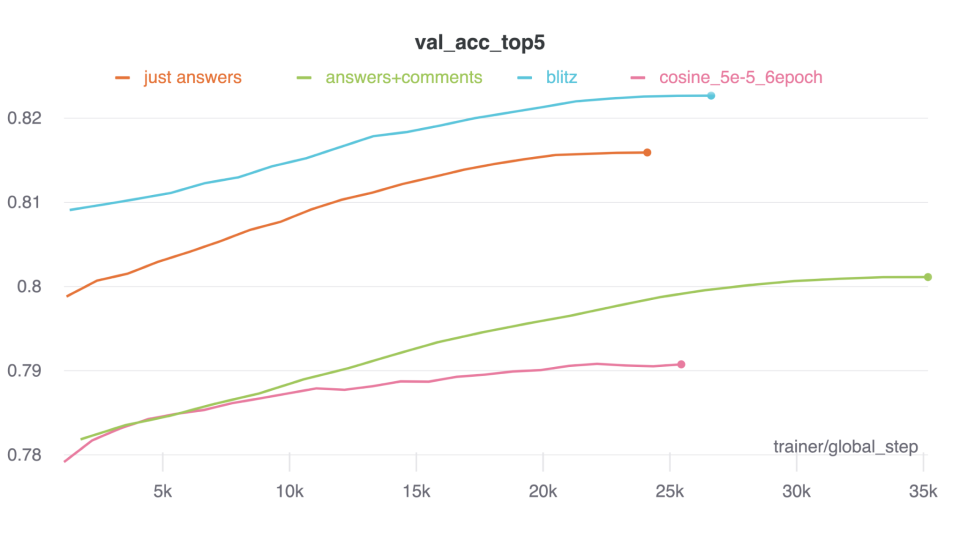

# CHGK

# Data
Data is collected from [open database of CHGK questions](https://db.chgk.info/) and cleaned.  
Resulted dataset could be found [here](data/dataset_reduced_filtered_super_mega.zip).


# Telegram bot
* Natasha for domain recognition
* Finetuned RU-GPT3Small for question generation
* RuBert + KMeans for theme detection


# Questions generation
In order to generate questions there is `generate.py` CLI script. From the project root run:
```
PYTHONPATH=. python src/generation/generate.py --model_dir <DIRECTORY_WITH_MODEL> --beam_size <BEAM_SIZE> --max_len <MAX_SEQ_LEN_TO_GENERATE> --context <CONTEXT_TO_GENERATE_FROM>
```
For now generation has only 2 parameters: 
1. `beam_size` --- number of generated hypothesis
2. `max_len` --- length of a generated question

## Examples (context | continuation)
* Согласно известному утверждению, еж - это | не только еж, но и ежиха. А что это за еж?
* За границей он бывает сопроводительный, | а иногда и предупреждающий. В России он - "второй", а в Германии - первый. Назовите его.
* Рассказывают, что на съемках фильма | "Броненосец Потемкин" в Москве в конце концов был найден ИКС. В одном из эпизодов фильма ИХ было два. Назовите ИХ.
* Началось всё с того, что | в одном из эпизодов фильма "Брат" герой, не желая идти на контакт с девушкой, говорит ей: "Я не хочу, чтобы ты была...". Закончите фразу.
* Подразделение такого типа численностью в | несколько десятков человек, состоящее из двух человек и двух десятков собак, было создано в США в начале XX века. В России же оно появилось в конце XIX века, но в России его название было заменено на более привычное нам. Как же называется это подразделение?
* Борис Пастернак писал: "И полусонным | сном, и с утра, И с похмелья, как в бреду, Я проснулся, а в постели -...". Закончите это четверостишие.
* Борис Пастернак писал: 'И полусонным | днем в деревне, Где ни зги, ни мороза, Мы снова собрались на...". На кого же?
* В статье "Российской газеты", посвященной | событиям в Чечне, говорится, что в ходе операции "Буря в пустыне" в чеченских горах погибло около двух тысяч человек. В заголовке статьи упоминается ОНА. Назовите ЕЕ двумя словами.
* От сильно переделанного сценария этого | фильма, вышедшего в 1975 году, осталась только одна фраза. Назовите этот фильм.
* Однажды Платон сказал, что есть | четыре вещи, от которых следует отказаться: от лжи, от честолюбия и от праздного любопытства. Назовите четвертую вещь.
* В Древней Греции считали, что | ЭТО - самое безопасное средство, поскольку обладает свойством, указывавшим на его эффективность при изготовлении оружия, а также с успехом применяется при лечении. Что это?
* Рассказывают, что на съемках фильма | о жизни в СССР с участием актеров А.Анисимова и В.Кавелина возникли сложности. Съемочная группа долго не могла найти подходящего декоратора. Наконец один из актеров заявил: "Есть только два места, где мы можем поставить что-нибудь, кроме этого, - это... это...". Закончите мысль двумя словами.

## Clusters



# Trained models
## HTML data
* [Const lr model](https://hse-dl-models.s3.eu-central-1.amazonaws.com/model_const.tar.gz)
* [Cosine lr no decay model](https://hse-dl-models.s3.eu-central-1.amazonaws.com/cosine_no_decay.tar.gz)

## XML data
* [Cosine lr no decay model](https://hse-dl-models.s3.eu-central-1.amazonaws.com/new_data.tar.gz)
* [Blitz model](https://hse-dl-models.s3.eu-central-1.amazonaws.com/blitz_model.tar.gz)
* [Answers in context model](https://hse-dl-models.s3.eu-central-1.amazonaws.com/answers_100_20_model.tar.gz)

## Validation accuracy-top-5
Лучший [результат](https://wandb.ai/falca/hse_dl_project/runs/ca4av3wz?workspace=user-falca) по метрикам:




# Contributions
* A. Kotov: bot structure, theme recognition
* Lebedev: data collecting
* Nikolin: theme recognition
* Semin: RU-GPT3Small finetuning, generation implementation

Everyone contributed equally at the data cleanup and bot testing phases.
